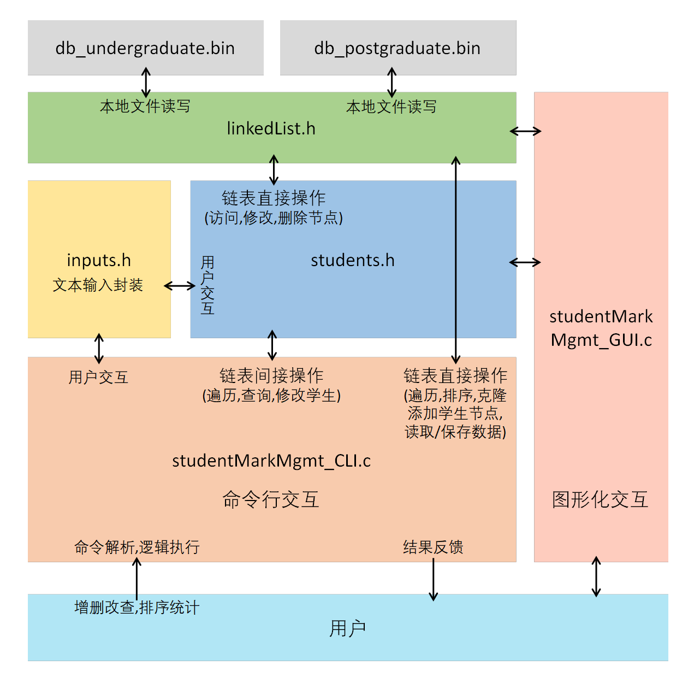
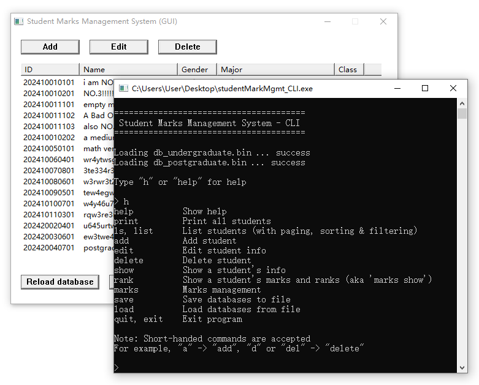

## Student Marks Management System 【学生成绩管理系统 (大一下C语言大作业)】




### Student ID format:
```
2024    1               233     06      23
↑       ↑               ↑       ↑       ↑
Year    Type:           Major   Class   Order
        1=Undergraduate 
        2=Postgraduate  
```

### Usage
```
help          Show help
print         Print all students
ls, list      List students (with paging, sorting & filtering)
add           Add student
edit          Edit student info
delete        Delete student
show          Show a student's info
rank          Show a student's marks and ranks (aka 'marks show')
marks         Marks management
save          Save databases to file
load          Load databases from file
quit, exit    Exit program
```

**Note: Short-handed commands are accepted**  
For example, "a" -> "add", "d" or "del" -> "delete"


### Screenshots

- Running `ls undergraduate` to list students with filter:

```
Displaying 1 - 10 of 13

Student ID     Name                 Gender   Major        Class       Math  Eng   C     Total
---------------------------------------------------------------------------------------------
202410010101   i am NO.1!           Male     major1       Class 11    99    99    99    297
202410011103   also NO.1!           Female   major1       Class 11    99    99    99    297
202410010201   NO.3!!!!!            Female   major1       Class 11    99    98    97    294
202410010202   a medium one         Male     major1       Class 2     77    82    95    254
202410050101   math very bad        Female   wfrawqr      Class 1     23    88    74    185
202410011102   A Bad One            Male     major1       Class 11    24    64    33    121
202410011101   empty marks          Male     major1       Class 11    -1    -1    -1    -1
202410060401   wr4ytwsg             Female   rew3rt3      Class 4     -1    -1    -1    -1
202410070801   3te334r32            Male     te5ju        Class 8     -1    -1    -1    -1
202410080601   w3rwr3t2qe           Female   w3t5         Class 6     -1    -1    -1    -1

Arrow keys: Navigate        Home/End: First/Last Page         z: Page size
s: Sort by     o: Sort order     f: Filter     r: Reset     q/Ctrl-C: Quit
```
